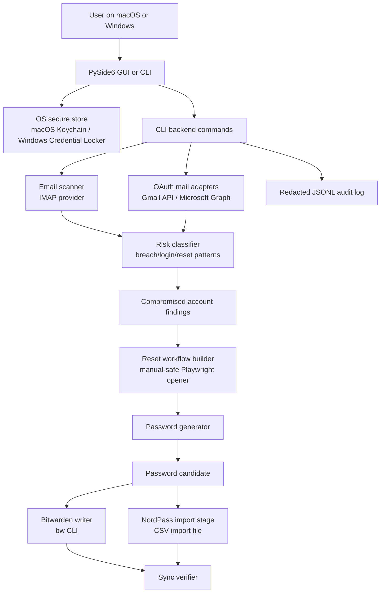

# Account Recovery Guard

Local-first account recovery and password rotation assistant for macOS and Windows.

## Authors

- Antman1526
- Codex

## Recommended Approach

Use a single Python 3.11+ codebase with a CLI and a PySide6 desktop GUI. Python gives strong cross-platform parity, stable IMAP support in the standard library, OAuth provider libraries for Gmail/Microsoft Graph, a mature OS credential-store wrapper, and direct subprocess integration with the Bitwarden CLI. The tool intentionally avoids full reset-form automation because password reset pages vary, use MFA/CAPTCHA, and are high-risk if scripted blindly.

Critical decision: Bitwarden can be written programmatically through the official `bw` CLI. NordPass personal vaults do not expose an equivalent public CRUD API, so this project stages a NordPass CSV import file and verifies sync from a NordPass export. Browser-extension scraping is deliberately not implemented.

Bitwarden and NordPass are therefore not "linked" as one live vault. This tool acts as a local controller:

1. Discover account signals from inboxes you authorize.
2. Check risk signals and optional Have I Been Pwned results.
3. Generate five replacement password choices locally.
4. Let you manually complete the reset with MFA/passkey/CAPTCHA intact.
5. Write Bitwarden through `bw`.
6. Stage a NordPass import file and verify NordPass after you import/export.

## Architecture



## Email Scanning

The runnable implementation uses IMAP over TLS for broad compatibility. It scans recent mailbox messages, classifies subjects/bodies/senders for breach and security-alert language, extracts reset/recovery/security links, and returns service name, sender domain, reset link, timestamp, severity, and reasons.

It also includes linked-account discovery. This does not log in to random websites or scrape the open web. It derives likely account relationships from authorized mailbox evidence such as welcome emails, verification emails, security alerts, password resets, MFA/passkey notices, billing/subscription emails, and receipts.

For personal Gmail, the easiest consumer setup is now Gmail IMAP with a Google app password. The app password is entered once, stored in the OS credential store, and used over IMAP/TLS to scan Gmail's All Mail folder.

For Gmail and Outlook/Microsoft 365 in stricter environments, the more robust long-term approach is provider APIs:

- Gmail API: best for OAuth, labels, search, and avoiding app passwords.
- Microsoft Graph Mail API: best for Outlook/Microsoft 365 and supports mailbox message listing.
- IMAP: easiest to run locally, but weaker than OAuth provider APIs and often requires app passwords.

Current code ships IMAP plus optional OAuth adapters:

- The GUI Gmail path uses `imap.gmail.com`, your Gmail address, and a Google app password. It scans `[Gmail]/All Mail` by default.
- `scan-gmail-app-password` is the matching CLI command for personal Gmail app-password scanning.
- `scan-gmail` uses Gmail API OAuth with a local browser consent flow and stores the token JSON in the OS credential store. Use this advanced path when app passwords are blocked.
- `scan-graph` uses Microsoft Graph with MSAL device-code flow and stores the token cache in the OS credential store.
- `scan-imap` remains the fallback for providers without OAuth setup.

## Web Breach Checking

The `breach-check` command integrates with Have I Been Pwned (HIBP) for account-level breach checks. HIBP breached-account checks require an API key and send the searched email address to HIBP. This is the optional paid path. The tool stores the HIBP key in the OS credential store and logs only breach counts, not the API key.

The default exposure workflow is free-only. `exposure-plan` will not run the paid HIBP email-breach lookup unless you pass both `--hibp-secret` and `--allow-paid-email-lookup`.

This tells you whether the email address appeared in known breach datasets. It does not prove that every linked service account is compromised, and it cannot detect private breaches HIBP does not have.

The `pwned-password` command uses the free HIBP Pwned Passwords k-anonymity range API. It does not require a HIBP API key. Only the first five SHA-1 hash characters are sent to HIBP; the plaintext password is read from the OS credential store and is never logged.

Risk scoring combines mailbox findings, discovery confidence, breach names, reused-password evidence, and MFA unknown status. Scores are local signals for prioritization, not proof of compromise.

The `exposure-plan` command is the safe replacement for "search the whole web for my password." It combines:

- authorized mailbox scan results,
- discovered accounts from your mailbox,
- optional paid HIBP breached-account results,
- optional free HIBP Pwned Passwords checks.

It does not crawl paste sites, dark-web sources, criminal forums, or random web pages for plaintext passwords. That boundary is deliberate: those sources can expose you further, produce unreliable data, and create legal/security risk. The app uses reputable breach intelligence and tells you which accounts to rotate first.

## Vault Integration

Bitwarden:

- Uses `bw get template item`, modifies the login item JSON, `bw encode`, then `bw create item` or `bw edit item`.
- Requires `BW_SESSION` in the environment. The tool never stores your Bitwarden master password or session token.

NordPass:

- Stages a CSV import file formatted for NordPass import.
- You import it manually in NordPass, then export from NordPass and run `verify-sync`.
- The CSV necessarily contains plaintext passwords because NordPass import requires that form. It is written with restrictive permissions where the OS allows it and must be deleted after import.
- `csv-status` warns about stale plaintext NordPass CSV files, can delete them after import, and reports deletion failures instead of clearing the warning silently.
- `vault-dashboard` compares exported Bitwarden/NordPass CSVs and reports `in_sync`, `drift`, `bitwarden_only`, and `nordpass_only` rows.

## Passkeys and Device Storage

Passkeys are not a general-purpose encrypted storage bucket for arbitrary account information. They are authentication credentials used to sign in to a relying party. This tool stores local secrets in the OS credential store:

- macOS: Keychain, which can be protected by your device login and, depending on settings, Touch ID/iCloud Keychain.
- Windows: Credential Locker, which can be protected by your Windows account and Windows Hello policies.

Bitwarden and NordPass can store and sync passkeys for websites that support them, but this CLI cannot safely create passkeys for third-party websites on your behalf. During password rotation, use the service's official passkey enrollment flow manually when available, then save that passkey in your chosen password manager.

Use `passkey-guidance --service <name>` for safe enrollment steps. The GUI also includes a passkey guidance panel.

## Security Design

Secrets:

- IMAP app passwords and generated replacement passwords are stored with Python `keyring`, which uses macOS Keychain and Windows Credential Locker on those platforms.
- `BW_SESSION` is read from the process environment only.
- Gmail OAuth token JSON and Microsoft Graph MSAL token caches are stored through the same OS secure-store layer.
- OAuth failure messages shown by the app are sanitized so provider token payloads are not echoed to users or logs.
- Advanced GUI command previews expect saved secret names, not actual passwords or tokens. If a secret-name field looks like a direct password or token, the preview replaces it with `<save-secret-in-os-credential-store-first>`.

MFA:

- The tool never bypasses MFA, CAPTCHA, device approval, or risk checks.
- Verified reset links opened from the GUI or CLI use a visible Playwright recovery browser for manual completion, and that recovery browser session blocks common installer, archive, and script downloads.
- When the guided GUI falls back to opening the official site, it uses the same protected no-download recovery browser instead of the default system browser.
- Recovery URLs that point directly to common installer, archive, disk image, or script file types are rejected before the protected browser opens.
- You remain responsible for confirming the domain before entering a generated password.
- The `rotate` command requires you to type `ROTATED` before vault writes so the vault does not get ahead of the real account state.
- `rotate` masks the five generated choices by default and reveals only the selected password. `--copy-selected` copies it to the clipboard and clears it after 60 seconds when the platform supports it, but only if the clipboard still contains that copied password.

Logging:

- Audit logs are JSONL and include events such as scan count, vault update, NordPass CSV staging, and sync result.
- Passwords, tokens, secrets, sessions, authorization headers, cookies, email addresses, usernames, mailbox identifiers, reset-link parameters, and token-like values embedded in messages are redacted.
- Email bodies and plaintext credentials are never written to the audit log.

Threat model:

- Protects against reused passwords, stale compromised credentials, forgotten breach alerts, and vault drift between Bitwarden and NordPass.
- Reduces local secret exposure by using OS credential storage and avoiding plaintext logs.
- Does not protect against malware already running as your user, phishing pages you approve manually, compromised password-manager accounts, or provider-side account takeover.
- This is not antivirus software. If malware, a keylogger, remote-control tooling, or a hostile browser extension is already running on the device, it can potentially observe local vaults, clipboard contents, browser sessions, and recovery workflows.

## Malware and Installer Trust

Use installers only from the official repository and verify checksums before running them:

- GitHub repository: `https://github.com/Antman1526/AccountRecoveryGuard`
- macOS: prefer a signed and notarized `.dmg`.
- Windows: prefer a signed `.exe`; unsigned PyInstaller executables are development artifacts and may be quarantined by antivirus tools.
- Keep Gatekeeper, XProtect, Microsoft Defender, and trusted endpoint protection enabled.
- Do not bypass malware warnings unless you have verified the artifact source, checksum, and signing status.
- Release builds include a JSON manifest with the artifact name, size, SHA-256, git commit, GitHub run ID, platform, and signing status.
- See the root `SECURITY.md` for the release checklist and reporting process.

## Install: macOS

```bash
cd /Users/Antman/Desktop/AccountRecoveryGuard/account-recovery-guard
python3 -m venv .venv
source .venv/bin/activate
python -m pip install --upgrade pip
python -m pip install -r requirements.txt
python -m pip install -e .
python -m pip install ".[gui,oauth]"
python -m playwright install chromium
```

Install Bitwarden CLI:

```bash
brew install bitwarden-cli
bw login
export BW_SESSION="$(bw unlock --raw)"
```

Install NordPass desktop or use the NordPass web vault. Import/export remains manual.

## Install: Windows PowerShell

```powershell
cd $HOME\Desktop\AccountRecoveryGuard\account-recovery-guard
py -3.11 -m venv .venv
.\.venv\Scripts\Activate.ps1
python -m pip install --upgrade pip
python -m pip install -r requirements.txt
python -m pip install -e .
python -m pip install ".[gui,oauth]"
python -m playwright install chromium
```

Install Bitwarden CLI with the official installer or package manager, then:

```powershell
bw login
$env:BW_SESSION = bw unlock --raw
```

Install NordPass desktop or use the NordPass web vault. Import/export remains manual.

## Configure Email

For Gmail personal accounts, use a Google app password instead of your normal Google password. In the GUI, choose Gmail, enter your Gmail address, paste the 16-character app password, and leave "Scan full Gmail mailbox" enabled.

For the CLI, omit the secret value so the app prompts for hidden input instead of saving it in shell history. The `secret` command refuses positional secret values unless you explicitly add `--allow-shell-history-secret`.

```bash
arg secret gmail-app-password-you@gmail.com
arg scan-gmail-app-password --username you@gmail.com --secret-name gmail-app-password-you@gmail.com
```

The default Gmail app-password scan checks `[Gmail]/All Mail`. To scan only recent Inbox messages:

```bash
arg scan-gmail-app-password --username you@gmail.com --secret-name gmail-app-password-you@gmail.com --recent-inbox --days 30
```

For generic IMAP:

```bash
arg secret gmail-imap-app-password
arg scan-imap --host imap.gmail.com --username you@gmail.com --secret-name gmail-imap-app-password --days 30
```

Discover likely linked accounts from inbox evidence:

```bash
arg discover-imap --host imap.gmail.com --username you@gmail.com --secret-name gmail-imap-app-password --days 365
```

For Gmail OAuth:

```bash
arg scan-gmail --client-secret-file /path/to/google-oauth-client.json --days 30
```

For Microsoft Graph device-code auth:

```bash
arg scan-graph --tenant-id common --client-id YOUR_ENTRA_APP_CLIENT_ID --days 30
```

Gmail notes:

- Do not enter your normal Google password in this app.
- Google app passwords require 2-Step Verification and may not be available for work/school accounts, accounts with only security-key 2-Step Verification, or Advanced Protection.
- If app passwords are blocked, use the advanced OAuth/Gmail API setup.

Outlook/Microsoft 365:

- Prefer Microsoft Graph for production.
- IMAP host is commonly `outlook.office365.com`, but tenant policies may block basic IMAP/app-password workflows.

## Usage

Generate a password:

```bash
arg generate-password --length 32
arg generate-password --passphrase --words 6
```

Launch the desktop GUI:

```bash
arg gui
account-recovery-guard-gui
```

The GUI opens to a guided first-run flow:

- Follow a protection checklist for email connection, local scan, account review, password exposure check, and vault sync.
- See the safe recovery boundary on first launch: authorized mailbox evidence plus free HIBP k-anonymous checks, not unsafe whole-web or dark-web crawling.
- Label who the scan is for, using quick choices like `Me` or `Second person`, without creating a stored profile.
- Protect one mailbox at a time; run a separate scan for a second person only when they are present and have asked you to help.
- Require an extra in-app confirmation before scanning a mailbox labeled for someone other than `Me`.
- Connect Gmail, Outlook, or Other Email.
- See only the provider setup fields that apply to the selected provider.
- For personal Gmail, follow the in-app app-password steps; no Google OAuth JSON import file is needed unless you choose advanced setup.
- Gmail setup rejects values that do not look like a 16-character Google app password before saving anything.
- See the scan scope before starting: personal Gmail full-mailbox mode scans Gmail All Mail, while Outlook/Other Email use a broad date-limited scan that can be increased.
- Confirm you have permission to scan the selected mailbox before the scan can start.
- Review scan consent and provider setup before scanning starts.
- Review a clear next safest action plus the accounts needing attention found by the scan.
- Review linked accounts found from mailbox evidence separately from accounts needing attention, so ordinary account evidence is not treated as proof of compromise.
- Read a plain-English protection plan that separates what the app knows, what it cannot prove, the next safe action, and the guardrail that keeps recovery local-first.
- Interpret scan results safely: mailbox findings are risk signals, and "no urgent alerts" does not prove every password is safe.
- Read safe `http`/`https` links from HTML email buttons so security alerts with button-only reset links are not missed.
- Flag reset/security links whose domain does not match the sender's expected service domain as higher-risk phishing signals.
- Check one reused password directly from the Results or Dashboard screens with the free HIBP k-anonymous range check; the field is cleared after checking.
- Keep the password exposure button disabled until a password is entered and the user confirms it is old or reused, not newly generated.
- Avoid sending the same password check repeatedly in one app session; repeated checks reuse a local keyed fingerprint result instead of contacting HIBP again.
- Use the password-exposure result to guide rotation without overstating certainty: if the checked password was found, rotate only accounts where you reused it, one at a time.
- Open reset links only when they use HTTPS, match the expected service domain, and do not contain unsafe redirect targets; otherwise use the official site or app manually.
- Open guided official-site fallbacks in the protected no-download recovery browser instead of the default system browser.
- Reject direct installer/archive/script/disk-image recovery URLs before opening the browser, and block those file types during protected recovery sessions.
- Require confirmation that you are on the official site/app or verified reset page before copying a generated password.
- Rotate passwords with masked choices, then prepare vault sync only after confirming the password was changed on the real service and the new password works.
- Stage the NordPass import CSV from the guided rotation flow, import it immediately, verify, and delete it after use with the in-app cleanup button.
- Keep advanced copied command previews from showing likely direct passwords or tokens in saved-secret fields.

After a scan exists, the dashboard shows an account safety summary, accounts needing attention, vault sync status, cleanup reminders, and secondary advanced tools for troubleshooting.

Check what is ready without paying for anything:

```bash
arg setup-check
```

This labels local free setup as `ready` or `action_needed`, and labels paid-only upgrades such as Apple notarization, Windows code signing, and optional HIBP email-breach lookup as `paid_optional`.

Optional paid lookup: check an email address against Have I Been Pwned:

```bash
arg secret hibp-api-key
arg breach-check --email you@example.com --hibp-secret hibp-api-key --allow-paid-email-lookup
```

`breach-check` intentionally refuses to run without `--allow-paid-email-lookup` because this path requires a paid HIBP API key and sends the searched email address to HIBP.

Check an old or reused password against HIBP Pwned Passwords. Omit the value so it is entered at the hidden prompt:

```bash
arg secret candidate-password
arg pwned-password --password-secret candidate-password
```

This is the free check. It uses the HIBP Pwned Passwords range API and does not require a HIBP API key.

Create a safe exposure plan from mailbox scan JSON plus the free password check:

```bash
arg exposure-plan \
  --email you@example.com \
  --password-secret candidate-password \
  --accounts-json accounts.json \
  --findings-json findings.json
```

Stay on the free path by omitting `--hibp-secret`. Add the optional paid HIBP email-breach lookup only after you have a HIBP API key and you accept that the searched email address is sent to HIBP:

```bash
arg exposure-plan \
  --email you@example.com \
  --hibp-secret hibp-api-key \
  --allow-paid-email-lookup \
  --password-secret candidate-password \
  --accounts-json accounts.json \
  --findings-json findings.json
```

The exposure plan prioritizes accounts to rotate. If the checked password appears in HIBP Pwned Passwords, rotate every account where you used that password.

Rotate with five local password choices:

```bash
arg rotate \
  --service Example \
  --username you@example.com \
  --url https://example.com \
  --reset-link https://example.com/reset \
  --open \
  --copy-selected
```

The command shows five masked generated passwords, reveals only the one you choose, opens the reset link if requested in a no-download recovery browser, waits for you to complete MFA/CAPTCHA/passkey prompts manually, then only writes vaults after you confirm the new password works and type `ROTATED`.

Store a generated password in the OS credential store. Omit the value so it is entered at the hidden prompt:

```bash
arg secret new-example-password
```

Write to Bitwarden and stage NordPass import:

```bash
arg write-vaults \
  --service Example \
  --username you@example.com \
  --url https://example.com \
  --password-secret new-example-password
```

Verify sync after importing into NordPass and exporting a CSV from NordPass:

```bash
arg verify-sync \
  --service Example \
  --username you@example.com \
  --url https://example.com \
  --nordpass-export /path/to/nordpass-export.csv
```

Run a marked live vault test:

```bash
arg vault-live-test --username you@example.com
```

This creates a clearly named `ARG-LIVE-TEST-*` credential in Bitwarden if `bw` and `BW_SESSION` are available, and stages a NordPass CSV for manual import. On a machine without Bitwarden CLI/session, use `--skip-bitwarden` to test only the NordPass staging path.

Show a broader drift dashboard from vault exports:

```bash
arg vault-dashboard --bitwarden-export bitwarden.csv --nordpass-export nordpass.csv
```

Check or delete a staged plaintext NordPass CSV:

```bash
arg csv-status
arg csv-status --delete
arg csv-status /path/to/nordpass-import.csv
arg csv-status /path/to/nordpass-import.csv --delete
```

Show passkey enrollment guidance:

```bash
arg passkey-guidance --service GitHub
```

Run tests:

```bash
python -m pytest -q
```

Build a macOS `.dmg` locally:

```bash
chmod +x scripts/build_macos_dmg.sh
scripts/build_macos_dmg.sh
```

Build a Windows `.exe` on Windows:

```powershell
.\scripts\build_windows_exe.ps1
```

The GitHub Actions workflow at `.github/workflows/build-account-recovery-guard.yml` builds both artifacts on native runners and uploads them as workflow artifacts. The macOS DMG includes an `Applications` shortcut plus this README; the Windows artifact includes `README-Windows.txt` with install-warning context.

Signing hooks:

- macOS: set `MACOS_CODESIGN_IDENTITY` before `scripts/build_macos_dmg.sh`. The script passes the identity and `packaging/macos-entitlements.plist` to PyInstaller.
- Windows: set `WINDOWS_SIGNTOOL_PATH` and `WINDOWS_CERT_SHA1` before `scripts/build_windows_exe.ps1`.
- Without signing variables, builds are development artifacts and may trigger OS warnings.
- Both packaging scripts emit SHA256 checksum files.
- Both packaging scripts verify their own checksum files and emit JSON artifact manifests for release traceability.

Create a GitHub Release:

```bash
gh workflow run release-account-recovery-guard.yml -R Antman1526/AccountRecoveryGuard -f tag=v0.2.0
```

Uninstall:

```bash
deactivate
rm -rf .venv
```

Then remove any secrets from Keychain/Credential Manager whose service is `account-recovery-guard`, and delete staged NordPass CSV files after import.

## Project Structure

```text
account-recovery-guard/
  README.md                         Architecture, setup, security model, and trade-offs.
  requirements.txt                  Runtime and test dependencies.
  requirements-build.txt            Build dependencies for packaged artifacts.
  pyproject.toml                    Package metadata and CLI entry points.
  .gitignore                        Ignores venvs, caches, build output, CSVs, and logs.
  .github/workflows/build-account-recovery-guard.yml GitHub Actions workflow for tests, macOS DMG, and Windows EXE.
  packaging/account_recovery_guard_entry.py PyInstaller entrypoint.
  packaging/macos-entitlements.plist macOS hardened-runtime entitlements template.
  scripts/checksums.py               Generates SHA256 checksum files for release artifacts.
  scripts/build_macos_dmg.sh        Builds one-file macOS binary and DMG.
  scripts/build_windows_exe.ps1     Builds one-file Windows EXE.
  src/account_recovery_guard/
    __init__.py                     Package version.
    account_discovery.py            Discovers likely linked services from authorized mailbox evidence.
    audit.py                        Redacted JSONL audit logger.
    breach_checker.py               Have I Been Pwned breached-account client.
    clipboard.py                     Clipboard copy with delayed clear where supported.
    cli.py                          Cross-platform command-line interface.
    email_scanner.py                IMAP scanner, body extraction, classifier, link extraction.
    exposure.py                     Safe exposure report combining mailbox evidence and breach intelligence.
    gui.py                          PySide6 guided desktop dashboard.
    gui_workflow.py                 Shared GUI workflow copy and command preview helpers.
    models.py                       Dataclasses shared across modules.
    oauth_mail.py                    Gmail API and Microsoft Graph OAuth mail adapters.
    passkeys.py                     Passkey support guidance.
    passwords.py                    Strong password/passphrase generation and fingerprinting.
    paths.py                        Cross-platform app data/log path helpers.
    readiness.py                    Free setup readiness checks and paid-optional boundary labels.
    reset_orchestrator.py           Manual-safe password reset workflow and Playwright opener.
    risk.py                         Local account risk scoring.
    rotation.py                     Five-choice password rotation helper.
    secure_files.py                 Plaintext CSV warning/deletion helpers.
    secure_store.py                 OS credential-store wrapper.
    sync.py                         Vault drift comparison.
    vaults.py                       Bitwarden CLI adapter and NordPass import/export adapter.
  tests/
    test_audit.py                   Verifies audit redaction.
    test_account_discovery.py       Verifies account discovery from inbox signals.
    test_breach_checker.py          Verifies HIBP parsing and 404 behavior.
    test_email_classifier.py        Verifies risky email classification and reset-link extraction.
    test_exposure.py                Verifies safe exposure-plan recommendations and boundaries.
    test_passwords.py               Verifies password/passphrase generation constraints.
    test_rotation.py                Verifies five unique password choices.
    test_rotation_safety.py         Verifies masked password choice display.
    test_pwned_passwords.py         Verifies HIBP k-anonymity response parsing.
    test_readiness.py               Verifies setup readiness and paid/free boundary reporting.
    test_risk.py                    Verifies local risk scoring.
    test_secure_files.py            Verifies stale CSV warnings.
    test_vault_dashboard.py         Verifies vault drift dashboard rows.
    test_live_vault.py              Verifies live-vault preflight and safe test entry construction.
    test_gui_workflow.py            Verifies copyable GUI command previews and recovery-flow copy.
    test_sync.py                    Verifies vault drift detection.
```

## Limitations and Trade-offs

- Full password reset automation is intentionally limited. MFA, CAPTCHAs, risk checks, and site-specific flows should stay human-approved.
- NordPass personal vault writes are not fully automatable through an official public CRUD API. CSV import/export is the safest supported path today.
- NordPass import/export CSVs contain plaintext passwords. Keep them local, import immediately, verify, then delete.
- IMAP scanning is practical and free for providers that support app passwords. Gmail API and Microsoft Graph OAuth are stronger for production, but require free provider-side app setup.
- Gmail API and Microsoft Graph adapters require you to create OAuth app credentials in Google Cloud or Microsoft Entra; those setup steps may be too technical for some users.
- The tool does not decide that an account is definitely compromised; it flags risk signals for review.
- HIBP Pwned Passwords checks are free and k-anonymous. HIBP breached-account email checks disclose the searched email address to HIBP and require a paid API key.
- Passkey creation remains a manual service-specific enrollment process.
- Signing requires your Apple Developer ID certificate and Windows code-signing certificate.
- A local macOS machine can create the `.dmg`; the Windows `.exe` should be built on Windows or via the included GitHub Actions workflow.

## Sources Checked

- Bitwarden CLI object creation and `bw encode`: https://bitwarden.com/help/cli/
- Bitwarden passkey login behavior and restrictions: https://bitwarden.com/help/login-with-passkeys/
- NordPass CSV import support and formatting: https://support.nordpass.com/hc/en-us/articles/360002377217-How-to-organize-CSV-file-for-import-to-NordPass
- NordPass passkey support overview: https://support.nordpass.com/hc/en-us/articles/12984678202641-Passkeys-FAQs
- NordPass import workflow: https://nordpass.com/features/import-password-securely/
- Gmail app-password requirements: https://support.google.com/mail/answer/185833
- Gmail API Python quickstart and OAuth client-library pattern: https://developers.google.com/workspace/gmail/api/quickstart/python
- Microsoft Graph mail messages: https://learn.microsoft.com/en-us/graph/api/user-list-messages?view=graph-rest-1.0
- Microsoft Graph Python device-code authentication: https://learn.microsoft.com/en-us/graph/tutorials/python-authentication
- Microsoft identity platform device-code flow: https://learn.microsoft.com/en-us/entra/identity-platform/scenario-desktop-acquire-token-device-code-flow
- PySide6 widgets and QMainWindow: https://doc.qt.io/qtforpython-6/PySide6/QtWidgets/index.html
- PyInstaller macOS signing options: https://pyinstaller.org/en/v6.7.0/feature-notes.html
- Python keyring supported backends: https://pypi.org/project/keyring/
- Playwright browser installation: https://playwright.dev/python/docs/browsers
- Have I Been Pwned API v3 breached-account behavior: https://haveibeenpwned.com/api/v3
- Have I Been Pwned Pwned Passwords range API is free and does not require authentication: https://haveibeenpwned.com/scalar/
